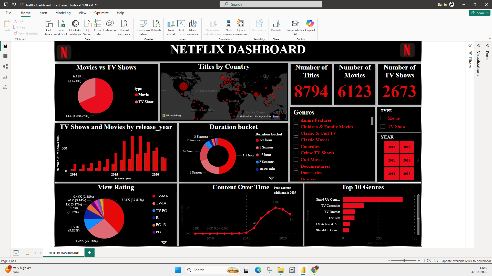

# Netflix Dashboard using Power BI

## Objective
This dashboard analyzes Netflix movies and TV shows by genre, rating, release year, country, and duration.

## Tools Used
- power BI
- Power Quary
- DAX
- Excel / CSV Dataset

## Dashboard Features
- Movies vs TV Shows comparison
- Country-wise content distribution
- Release year trend
- Content trend over time
- Top genres
- Rating analysis
- Duration bucket analysis
- Interactive slicers

## Key Insights
- Most Netflix content consistts of movies
- Peak content additions happened in 2019.
- TV-MA is the most common rating.
- Stand-Up Comedy is one of the top genres.

## Dashboard Screenshot

## Dataset
The data for this project is sourced from the Kaggle dataset:
- Dataset: [Movies Dataset](https://www.kaggle.com/datasets/shivamb/netflix-shows?resource=download)

